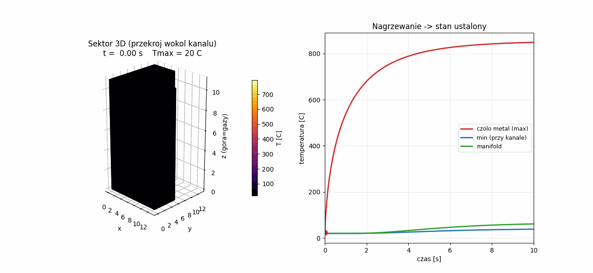

# MKWS — symulacja termiczna wtryskiwacza showerhead (HTP)

Symulacja nagrzewania wtryskiwacza typu *showerhead* podczas pracy komory
spalania na **nadtlenku wodoru (HTP)** jako utleniaczu (para HTP + etanol).
Celem jest wyznaczenie rozkładu temperatury w płycie wtryskiwacza oraz
**temperatury stanu ustalonego**.

## Model

- **Wycinek 3D (komórka jednostkowa / sektor)** wokół jednego z otworów
  showerhead. Powierzchnia czoła na jeden otwór = `A_face / n_holes`, więc
  podziałka `p = sqrt(A_face / n_holes)`. Modelowany jest prostopadłościan
  `p × p × L` z osiowym kanałem (otworem) w środku; ściany boczne adiabatyczne
  (symetria między sąsiednimi otworami).
- Pełne **przewodzenie 3D** (x, y, z), schemat jawny FTCS, wektoryzacja NumPy
  (bez SciPy).
- Bilans ciepła:
  - czoło komory (z=0): konwekcja gazu `h_gas·(T_gas−T)` + radiacja `εσ(T_gas⁴−T⁴)`,
  - ściana kanału: chłodzenie HTP `h_p·(T−T_prop)` (korelacja Dittusa-Boeltera),
  - manifold (z=L): `h_back·(T−T_prop)`.

## Uruchomienie

```bash
python3 injector_thermal_sim.py
```

Wymagania: `numpy`, `matplotlib`.

## Wyniki

Animacja 3D nagrzewania (przekrój wokół kanału) wraz z wykresami temperatury
w funkcji czasu:



Parametry (materiał, `h_gas`, `mdot`, geometria) zmienia się w sekcji
`@dataclass` oraz w funkcji `main()`.
